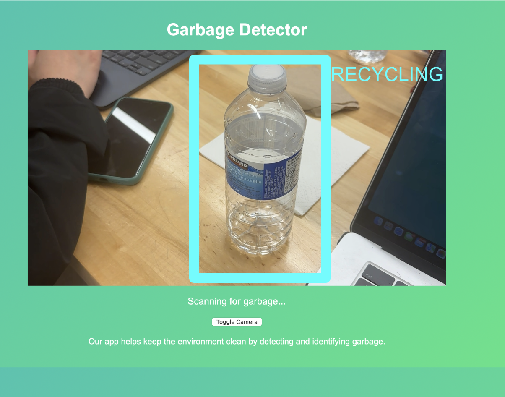
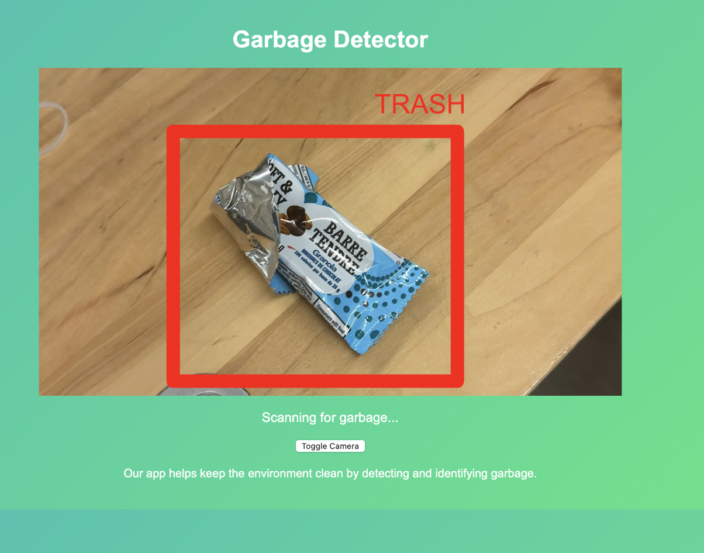

# Get Trash! 
GetTrash, a web app powered by Python, TensorFlow, and Streamlit, tackles environmental hazards by enabling live photo scanning and image captioning for waste sorting. Developed for Hack With AI, it clinched third place at the Google Developer SC-hosted event. Try it out to witness its impact firsthand!"

# Inspiration
GetTrash is inspired by the severe hazards that contaminate our environment. In fact, many animals, such as stray cats and dogs are seeking nourishment and get harmed by wastes scattered on the ground. Hence, we are inspired to find a solution to save lots of resources and protect people, animals, and the environment. Sorting your waste well helps to ensure that hazardous substances are disposed of safely. By separating different materials, most of them can also be recycled into new products.

# What it Does
GetTrash is a web app that contains two features, live-toggle image scanning and uploaded pictures. In the live-toggle image feature, the user is able to connect to their webcam or phone and scan a real-life object with ease. They can also upload an image at their convenience to get an image detection caption underneath the image.

# Using Tensor Flow
Using TensorFlow, we crafted a garbage classification model, transforming image data, constructing a CNN architecture, and training it to classify garbage images with increasing accuracy. Visualizing progress and saving the model was seamless, thanks to TensorFlow's efficient utilities. This endeavour embodies TensorFlow's prowess in empowering sustainable solutions.

# Challenges we ran into
It took very long for us to train the models under a variety of classifications. Additionally, the model we built was quite large (100mb+) and thus ran into difficulties processing it and sharing it through git and other team members. Additionally, with time constraints, it was hard to format output from the model.

# Images
   
   
   

# What's next for GetTrash
We hope to work on our web app more and improve our accuracy!

# Link to Devpost
https://devpost.com/software/gettrash
# Link to Youtube Demo
https://www.youtube.com/watch?v=VoDxWJuNdtI

# Citation

## open source data set
@misc{
                            garbage-classification-3_dataset,
                            title = { GARBAGE CLASSIFICATION 3 Dataset },
                            type = { Open Source Dataset },
                            author = { Material Identification },
                            howpublished = { \url{ https://universe.roboflow.com/material-identification/garbage-classification-3 } },
                            url = { https://universe.roboflow.com/material-identification/garbage-classification-3 },
                            journal = { Roboflow Universe },
                            publisher = { Roboflow },
                            year = { 2022 },
                            month = { mar },
                            note = { visited on 2024-05-19 },
                            }
